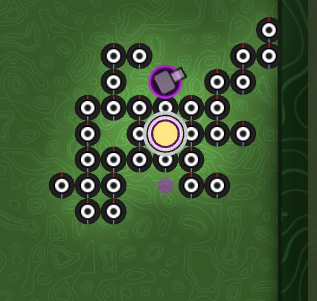

# Versions (Season 4 - Spawn and Swamp)

## v3 (Estimated: 579 MMR, Rank #26)

- First created creep is especially strong.
- Attack creeps now destory the nearby wall first before attacking.
- 2 Carry creeps are now made to ferry resources into spawn.
- Attack creeps now attack nearby enemies, regardless of position or state.

There's an amusing bug with this version that I want to keep and have on the ladder for someone to discover. If the enemy spawn is protected by a rampart the swarm won't actually hit it. This means it's possible to completely block an enemy spawn, but also not damage it. Notably this made a funny draw against RickStallion v53, but not always.

Tested against:
- Idle Opponent: ✅
- RickStallion v53 ❌
- temik911 v96: ❌
- RickStallion v42: ❌
- RickStallion v30: ❌
- yt/marlyman123 v322: ❌ 

## v1 (Estimated: 496 MMR, Rank #29)

Default example code. Can beat idle opponent, and not much else.
